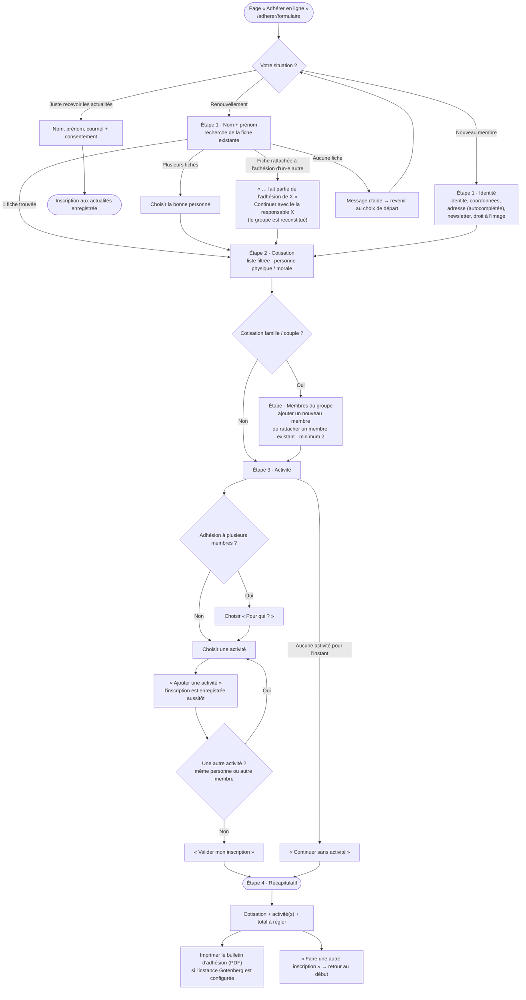

# Le parcours d'adhésion en ligne (former les collègues)

Formulaire public : **`/adherer/formulaire`**. Il enregistre directement dans
Grist (tables `Membres`, `Adhesions`, `Inscription`) — aucune saisie manuelle à
reprendre ensuite.

- **Ouvrir / fermer** les adhésions en ligne : `forms.adhesion.enabled` dans
  `src/config/site.ts` (`true` = ouvert). Fermé, le formulaire est remplacé par
  un message et le bouton « Adhérer en ligne » disparaît.
- Chaque étape n'apparaît qu'une fois la précédente validée.
- Le **règlement se fait sur place** (ou chez les partenaires) : le formulaire
  n'encaisse rien.

## Vue d'ensemble

## Étape par étape

### Départ — « Votre situation ? »

| Choix | Ce que ça fait |
| :--- | :--- |
| **Nouveau membre** | Première adhésion : on saisit toute la fiche. |
| **Renouvellement** | Déjà adhérent·e : on saisit seulement **nom + prénom**, le formulaire retrouve la fiche. |
| **Juste recevoir les actualités** | Nom + prénom + courriel + consentement → crée un simple contact, fin du parcours. |

### Étape 1 · Identité

- **Nouveau** : genre, identité, coordonnées, **adresse avec autocomplétion**
  (remplit code postal + commune), cases newsletter et droit à l'image. La date
  de naissance disparaît si le genre est « Association ».
- **Renouvellement** : après nom + prénom, quatre cas :
  - **1 fiche** → on continue ;
  - **plusieurs fiches** → on choisit la bonne (un indice « né·e en 19•• · ville »
    aide à distinguer) ;
  - **fiche rattachée à l'adhésion d'un·e autre** (elle figure dans le
    `Responsable_de` d'un·e autre membre — cas d'une famille / couple saisie du
    mauvais nom) → un encart indique le·la responsable de l'adhésion et propose
    **« Continuer avec … »** : le parcours repart au nom du·de la responsable et
    les membres du groupe sont reconstitués automatiquement. Un lien permet de
    **poursuivre malgré tout à son nom** (adhésion individuelle) ;
  - **aucune fiche** → message : vérifier l'orthographe ou repartir sur
    « Nouveau membre ».
- Les erreurs de saisie (courriel, code postal, téléphone…) s'affichent sous les
  champs ; l'envoi reste bloqué tant qu'il en reste.

### Étape 2 · Cotisation

- La liste ne montre que les cotisations compatibles : **personne physique** ou
  **personne morale** selon le genre.
- Une cotisation marquée **famille / couple** ouvre l'étape « Membres du groupe ».
  Sinon on passe directement à l'activité.

### Étape · Membres du groupe *(cotisation famille / couple uniquement)*

- Ajouter chaque membre : soit **créer une nouvelle fiche**, soit **rechercher
  et rattacher un membre existant**.
- **Minimum 2 membres** pour continuer. Un membre ajouté par erreur se retire ici.

### Étape 3 · Activité

- Si l'adhésion compte **plusieurs membres**, un menu **« Pour qui ? »** apparaît :
  on choisit à quel membre l'activité s'applique.
- On sélectionne une activité (« N places restantes » / « Complet » indiqués),
  puis :
  - **« Ajouter une activité »** → l'inscription est **enregistrée
    immédiatement** et s'ajoute à la liste ; on peut en ajouter d'autres (autre
    activité, ou même activité pour un autre membre). Un doublon (même membre +
    même activité) est refusé.
  - **« Valider mon inscription »** → enregistre l'activité encore sélectionnée
    puis va au récapitulatif.
  - **« Continuer sans activité »** (visible tant qu'aucune activité n'a été
    ajoutée) → récapitulatif sans inscription. Le choix pourra se faire plus
    tard directement dans Grist.
- Si une activité est complète, l'inscription part en **liste d'attente**
  (indiqué sur la ligne).

### Étape 4 · Récapitulatif

- Rappel : cotisation, **liste des activités**, **total à régler** (sur place).
- **« Imprimer le bulletin d'adhésion (PDF) »** : présent si l'instance Gotenberg
  est configurée sur le serveur (voir [bulletin-pdf.md](bulletin-pdf.md)). Ouvre
  le bulletin dans un nouvel onglet, prêt à imprimer.
- **« Faire une autre inscription »** repart d'une fiche vierge.

## Où vont les données

| Étape | Table Grist |
| :--- | :--- |
| Identité | `Membres` |
| Cotisation (+ membres du groupe) | `Adhesions` |
| Chaque activité ajoutée | `Inscription` (1 ligne par membre × activité) |

Détail technique et schéma des colonnes : [api.md](api.md).
