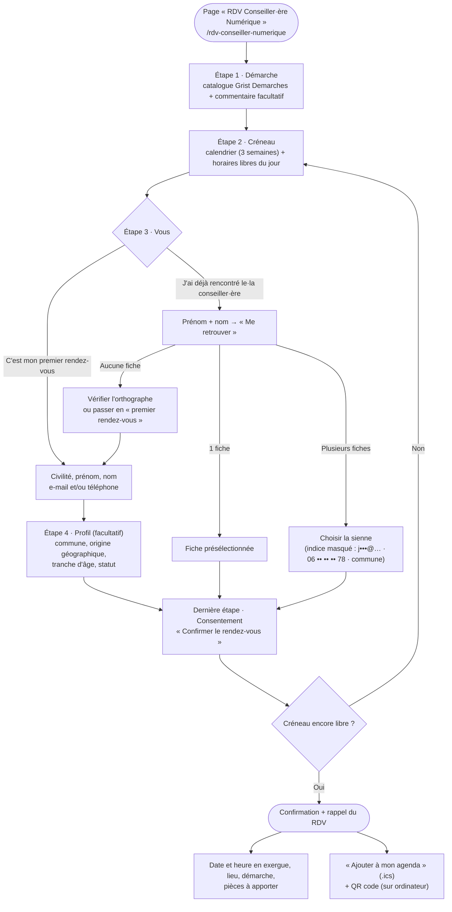

# La prise de RDV avec le·la Conseiller·ère Numérique (former les collègues)

Formulaire public : **`/rdv-conseiller-numerique`** (lien dans le menu, entre
Activités et Actualités, et encart sur la page d'accueil). Il enregistre
directement dans le document Grist **« RDV Conseiller Numérique »** (tables
`Beneficiaires`, `RDV`, `Demarches`) — aucune saisie à reprendre ensuite.

- **Ouvrir / fermer** la prise de RDV en ligne : `forms.rdvConseillerNumerique.enabled`
  dans `src/config/site.ts` (`true` = ouvert). Fermé, le formulaire est
  remplacé par un message ; l'encart de la page d'accueil reste affiché mais
  son bouton devient « Voir les permanences ».
- Chaque étape n'apparaît qu'une fois la précédente validée.
- Un RDV = **une démarche**, **30 minutes**, gratuit.
- Pas de compte ni de mot de passe : une personne déjà venue est retrouvée par
  son **prénom + nom**.

## Vue d'ensemble

## Étape par étape

### Étape 1 · Démarche

- La liste vient de la table Grist **`Demarches`** (voir
  [Gérer le catalogue de démarches](#gérer-le-catalogue-de-démarches)).
- **Une seule démarche** par rendez-vous : le créneau dure 30 minutes.
- Un **commentaire** facultatif permet de préciser le besoin ; il est repris
  dans la ligne `RDV` (`Commentaire_beneficiaire`).

### Étape 2 · Créneau

- Un calendrier propose les **3 prochaines semaines**. Seuls les jours de
  permanence sont sélectionnables ; un point marque ceux où il reste de la place.
- Les horaires du jour choisi s'affichent par tranche de **30 minutes** ; les
  créneaux déjà réservés sont barrés.
- Le jour même, un créneau qui commence dans **moins de 30 minutes** n'est plus
  proposé.
- Jours, horaires et lieux des permanences **ne sont pas dans Grist** : ils sont
  définis dans le code (`conseillerNumerique`, `src/lib/agenda.ts`). Actuellement
  du lundi au vendredi, 9 h – 12 h, à l'Ancienne mairie (le mercredi au
  Quartier de la Moustey).

### Étape 3 · Vous

Deux choix, pour **ne pas créer de doublons** dans `Beneficiaires` :

| Choix | Ce que ça fait |
| :--- | :--- |
| **C'est mon premier rendez-vous** | On saisit civilité, prénom, nom et **au moins un** e-mail ou téléphone (pour pouvoir prévenir la personne). Une fiche est créée à l'envoi. |
| **J'ai déjà rencontré le·la conseiller·ère** | On saisit seulement **prénom + nom**, le formulaire retrouve la fiche existante. |

- **Déjà venu·e** — trois cas après « Me retrouver » :
  - **1 fiche** → présélectionnée, on continue ;
  - **plusieurs fiches** (homonymes) → on choisit la sienne grâce à un indice
    **masqué** (`j•••@gmail.com · 06 •• •• •• 78 · commune`) ;
  - **aucune fiche** → message : vérifier l'orthographe (nom de naissance ou
    d'usage ?) ou continuer comme pour un premier rendez-vous.
- La recherche exige le prénom **et** le nom **exacts** (majuscules, accents et
  tirets ignorés : « jean-pierre » = « Jean Pierre ») : un nom partiel ne
  renvoie rien, pour qu'on ne puisse pas parcourir la liste des bénéficiaires.
- **Filet de sécurité** : même en « premier rendez-vous », si l'e-mail ou le
  téléphone saisi correspond à une fiche existante, c'est cette fiche qui est
  utilisée (et mise à jour), pas une nouvelle.
- Une personne déjà venue ne peut **pas modifier** ses coordonnées depuis le
  formulaire : à faire directement dans Grist.

### Étape 4 · Profil *(premier rendez-vous uniquement, facultatif)*

- **Commune** avec autocomplétion ; l'**origine géographique** est déduite
  de la commune (modifiable).
- **Tranche d'âge** et **statut**.
- Ces informations servent aux statistiques du dispositif (valeurs alignées sur
  le CRA de la Coop de la médiation numérique).
- Étape **sautée** pour une personne déjà venue : sa fiche est déjà renseignée.
  La dernière étape porte alors le numéro 4.

### Dernière étape · Consentement et envoi

- La case de consentement est obligatoire.
- À l'envoi, le créneau est **revérifié** : s'il vient d'être pris par
  quelqu'un d'autre, un message invite à en choisir un autre (la liste est
  rechargée).

### Après l'envoi · Confirmation

- **Rappel du rendez-vous** : date et horaires **mis en exergue**, lieu,
  démarche (et commentaire), puis les **pièces à apporter** si la démarche en
  liste. Les pièces ne sont rappelées **qu'ici**, pas pendant la saisie.
- **« Ajouter à mon agenda »** : ouvre l'événement dans l'agenda du téléphone
  (iPhone et Android), avec lieu, démarche et pièces à apporter en description.
- **QR code** (sur ordinateur seulement) : pour qui a réservé sur un PC, à
  scanner avec l'appareil photo du téléphone → « Ajouter à l'agenda ».

## Gérer le catalogue de démarches

Table Grist **`Demarches`**, tenue **directement dans Grist** par
l'association — pas d'administration côté site. Une nouvelle ligne apparaît
dans le formulaire au chargement suivant de la page.

| Colonne | Contenu |
| :--- | :--- |
| `Nom` | Intitulé affiché (ex. « Prédemande de carte d'identité ») |
| `Thematique` | Une thématique officielle du CRA (liste de choix) — sert aux statistiques, recopiée dans le RDV |
| `Icone` | Classe Font Awesome sans préfixe, ex. `fa-id-card` |
| `Description` | Courte explication affichée sous le nom |
| `Documents` | *Facultatif.* **Une ligne par pièce à apporter.** Une puce en début de ligne (`-`, `•`, `*`) est retirée automatiquement. |

## Où vont les données

| Moment | Table Grist | Ce qui est écrit |
| :--- | :--- | :--- |
| Premier RDV | `Beneficiaires` | Fiche créée (ou mise à jour si e-mail/téléphone déjà connu) : identité, coordonnées, profil, consentement, `Cree_le` |
| Déjà venu·e | `Beneficiaires` | **Rien** — la fiche existante est réutilisée telle quelle |
| Chaque RDV | `RDV` | `Beneficiaire`, `Date`, `Heure`, `Lieu`, `Demarche`, `Thematiques` (déduites de la démarche), `Commentaire_beneficiaire`, `Statut_rdv` = « Confirmé », `Cree_le` |

Après le rendez-vous, le·la conseiller·ère complète la ligne `RDV` **dans Grist**
(statut Honoré / Absent / Annulé, matériel utilisé, niveau d'autonomie,
orientation, notes…) : ces colonnes ne sont jamais écrites par le site.

**Annuler ou déplacer un RDV** : pas d'interface côté site pour l'instant. Passer
`Statut_rdv` à « Annulé » dans Grist libère le créneau.

## Comment ça marche techniquement

- **Page** : `src/pages/rdv-conseiller-numerique.astro`, îlot Vue
  `src/components/rdv/RdvForm.vue` (`client:load`) entouré de
  `<FormGate form="rdvConseillerNumerique">`.
- **Encart d'accueil** : `src/components/sections/RdvCtaSection.astro`, placé
  dans `src/pages/index.astro` avant « Envie de nous rejoindre ? ».
- **Code serveur** (`src/lib/rdv/`) :

| Fichier | Rôle |
| :--- | :--- |
| `grist.ts` | Tables et colonnes du document Grist — **seul endroit à modifier** si le schéma change |
| `choices.ts` | Valeurs des listes de choix (genre, tranche d'âge, statut, thématiques, zones, statuts de RDV) |
| `demarches.ts` | Lecture du catalogue `Demarches` |
| `creneaux.ts` | Créneaux de 30 min dérivés de `conseillerNumerique`, fenêtre de 21 jours, créneaux pris |
| `beneficiaires.ts` | Création / rapprochement (e-mail ou téléphone), recherche prénom + nom, contrôle de la fiche choisie |
| `reservation.ts` | Revérifie le créneau (et la fiche le cas échéant) puis écrit la ligne `RDV` |
| `ics.ts` | Événement d'agenda (fichier `.ics` et QR code), heure de Paris convertie en UTC |
| `validation.ts` | Contrôles de saisie côté navigateur (revérifiés par le serveur) |

- **Routes API** (`src/pages/api/rdv/`) :

| Route | Rôle |
| :--- | :--- |
| `GET /api/rdv/demarches` | Catalogue des démarches |
| `GET /api/rdv/creneaux` | Créneaux des 3 semaines, libres ou pris |
| `GET /api/rdv/commune?q=` | Autocomplétion de la commune |
| `GET /api/rdv/beneficiaires?prenom=&nom=` | Fiches correspondant **exactement** au prénom + nom, avec indice masqué uniquement |
| `POST /api/rdv/prendre` | Enregistre le RDV. Avec `beneficiaireId`, le serveur vérifie que la fiche porte bien ce prénom + nom (un identifiant seul ne suffit pas) |
| `GET /api/rdv/ics?date=&heure=&demarche=` | Fichier `.ics`. Lieu et pièces sont recalculés côté serveur : on ne peut pas faire servir un événement au texte arbitraire |

- **Variables d'environnement** (en plus de `GRIST_BASE_URL` et
  `GRIST_API_KEY`, voir [api.md](api.md#variables-denvironnement)) :

| Variable | Rôle |
| :--- | :--- |
| `GRIST_DOC_ID_RDV` | Identifiant du document Grist « RDV Conseiller Numérique » (distinct de celui de l'adhésion) |
| `GRIST_TABLE_BENEFICIAIRES` / `GRIST_TABLE_RDV` / `GRIST_TABLE_DEMARCHES` | Noms des tables si différents des défauts — optionnel |

## Pistes d'évolution

1. Recueillir l'évaluation du bénéficiaire (colonnes `Evaluation_satisfaction`
   et `Suggestions_beneficiaire` prêtes dans Grist, rien de branché).
2. Envoyer une confirmation ou un rappel par e-mail / SMS (`ics.ts` est
   réutilisable pour joindre l'événement).
3. Vue d'administration pour lister / annuler les RDV.
4. Permettre à une personne déjà venue de mettre à jour ses coordonnées.
